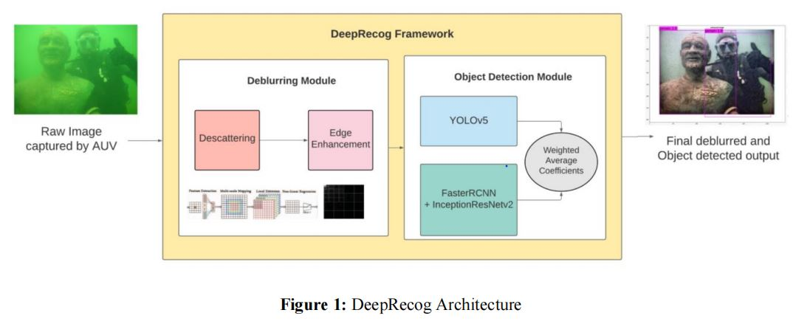
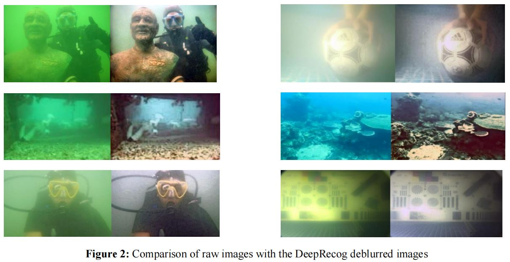
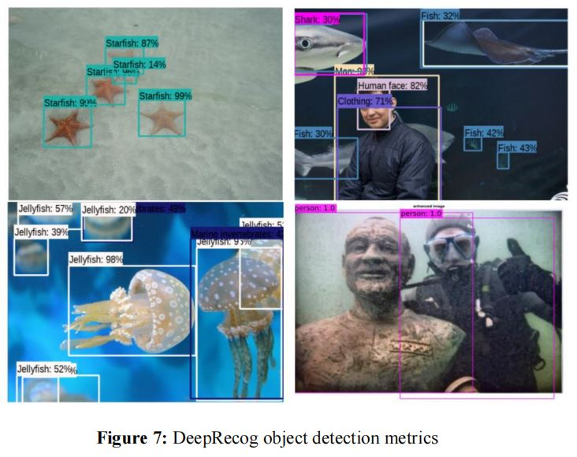
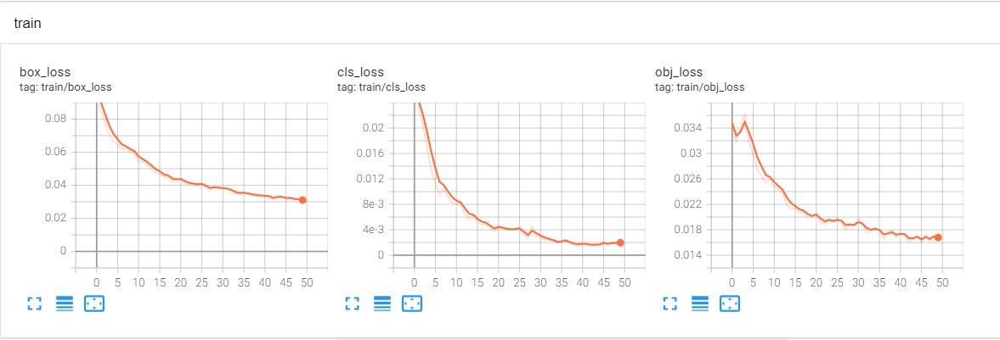
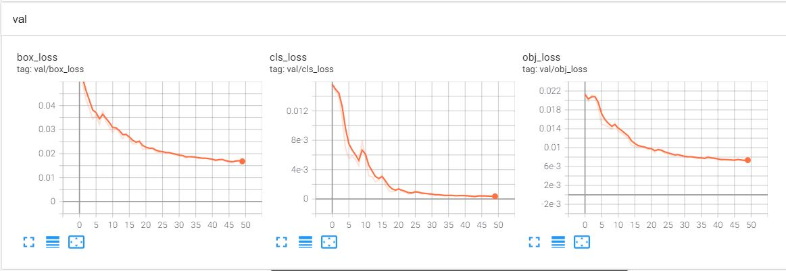

# DeepRecog - Image Deblurring and Object Detection framework for AUV vision systems

## Description 

This paper proposes DeepRecog - An integrated underwater image deblurring and object recognition framework for AUV 
vision systems. The principle behind the image deblurring module involves a three-fold approach consisting of 
CNNs, adaptive and transformative filters. The ensemble object detection and recognition module identifies 
marine life and other frequently existent underwater assets from AUV images

## Prerequisites

- [MATLAB](https://www.mathworks.com/downloads/)
- [Tensorflow 1.3](https://github.com/tensorflow/tensorflow)
- [Keras 2.0](https://github.com/fchollet/keras)
- [OpenCV-Python](https://github.com/opencv/opencv)
- [LabelImg](https://github.com/tzutalin/labelImg)

YOLO v5 Repository - 
- [YOLOv5](https://github.com/ultralytics/yolov5)

## Model Architecture

In this paper, we implement a a weighted 
ensemble object detection module implementing two recently established object detection models( YOLOv5 and 
a hybrid FasterRCNN+InceptionResNet V2). The weighted ensemble structure allows us to combine different 
structural mdels into the same module. The final prediction region is obtained from the models as by structuring 
them as coefficient weighted ensembles trained independently.

Framework :

## Results

### Deblurring Examples

### Object Detection Examples

### Metrics

mAP score is calculated by computing the mean AP over all IoU thresholds, depending upon the 
specific parameters of the model. A total of 1000 images [per class] were trained on the model for 50 epochs. 
Figure shows the metrics which threw a mAP accuracy score of 0.95, precision of 0.88 and recall of 0.93.

Training and Validation errors are shown below

## Conclusion

DeepRecog accomplishes the combinational proposal of integrating deblurring and object detection into a single 
application entity focused towards marine resource research and improving AUV vision. The proposed framework 
is more robust and surpasses several existing research works both in terms of individual module comparisons as 
well as complete framework analytics.The deblurration system provided a water specific methology for removal 
of haze and noise while preserving the visual integrity of the original image. The novel object detection module 
for underwater items was 6.42% more precise than YOLOv3, 8.43% more than FasterRCNN+VGG16 and 15.78% 
more than FasterRCNN. DeepRecog aims to bridge the gap between high resolution object detection and 
underwater vision. Future scope of research may be directed towards improving the object detection to suit niche 
requirements highly specific to marine exploration, which involves adding more classes of marine species, corals 
and other endangered ocean resources.
