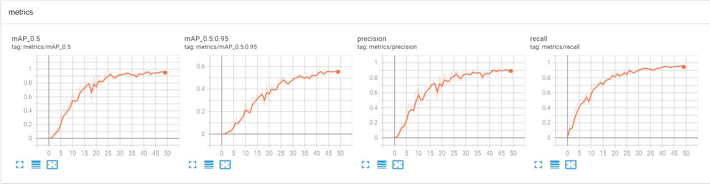

# DeepRecog - Image Deblurring and Object Detection framework for AUV vision systems

## Description 

This paper proposes DeepRecog - An integrated underwater image deblurring and object recognition framework for AUV 
vision systems. The principle behind the image deblurring module involves a three-fold approach consisting of 
CNNs, adaptive and transformative filters. The ensemble object detection and recognition module identifies 
marine life and other frequently existent underwater assets from AUV images

## Prerequisites

- [MATLAB](https://www.mathworks.com/downloads/)
- [Tensorflow 1.3](https://github.com/tensorflow/tensorflow)
- [Keras 2.0](https://github.com/fchollet/keras)
- [OpenCV-Python] (https://github.com/opencv/opencv)
- [LabelImg] (https://github.com/tzutalin/labelImg)

YOLO v5 Repository - 
- [YOLOv5] (https://github.com/ultralytics/yolov5)

## Model Architecture

In this paper, we implement a a weighted 
ensemble object detection module implementing two recently established object detection models( YOLOv5 and 
a hybrid FasterRCNN+InceptionResNet V2). The weighted ensemble structure allows us to combine different 
structural mdels into the same module. The final prediction region is obtained from the models as by structuring 
them as coefficient weighted ensembles trained independently.

Framework :

## Results

### Deblurring Examples

### Object Detection Examples

### Metrics

mAP score is calculated by computing the mean AP over all IoU thresholds, depending upon the 
specific parameters of the model. A total of 1000 images [per class] were trained on the model for 50 epochs. 
Figure shows the metrics which threw a mAP accuracy score of 0.95, precision of 0.88 and recall of 0.93.

